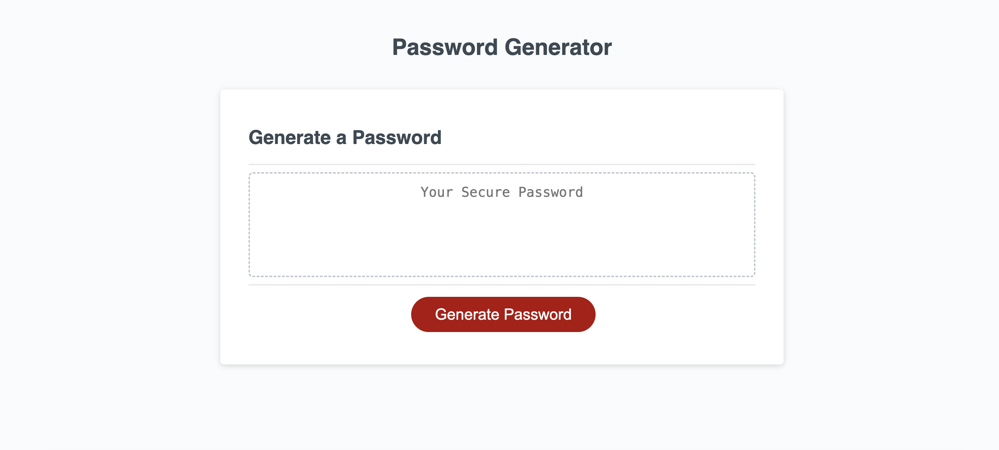

# password-generator1 

## Description

This was a fun application. In order to protect clients sensitive data a random password was generated using a set of random criteria to make a very strong password, creating less of a risk of being hacked.

## Screenshot

